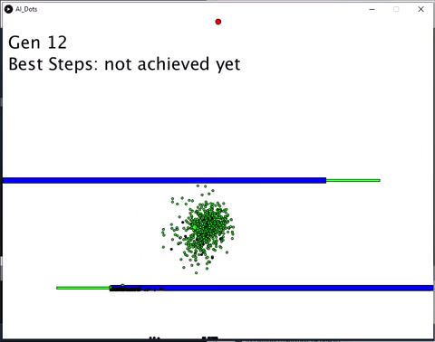

# Genetic algotithm: Basic path finding

A basic path finding using an incremental genetic algorithm and reinforcement learning.

The goal is to reach the red circle with the fewest step possible. The obstacle are in blue and going threw the green sticks give to a dot a reward.
